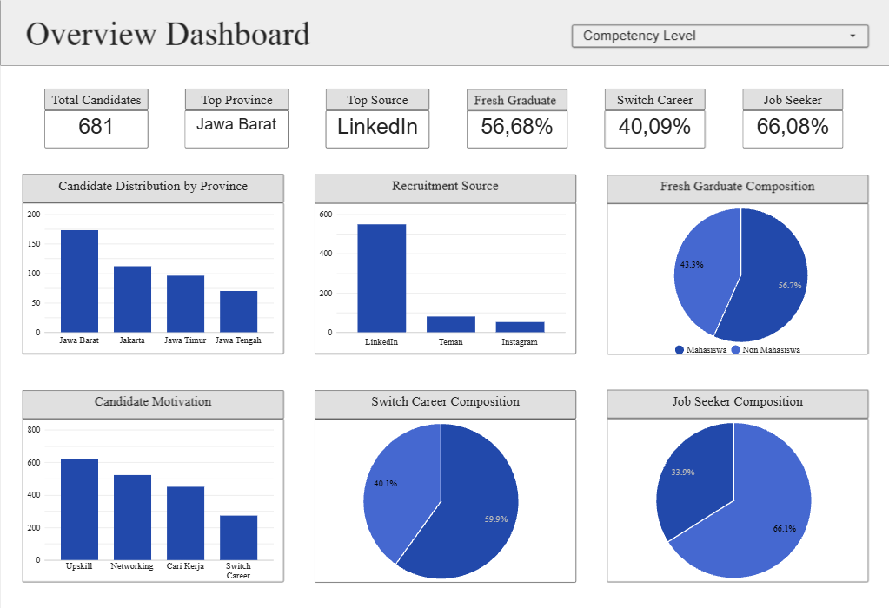
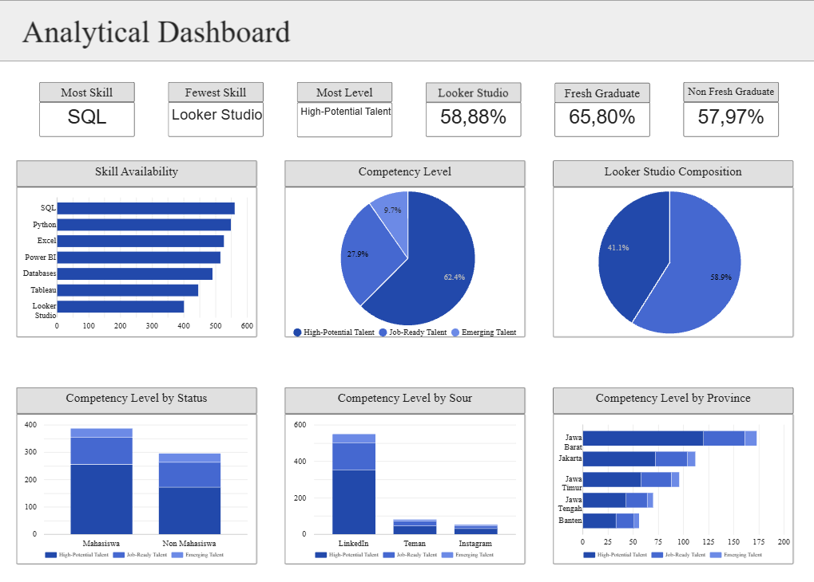

# Talent Recruitment Analytics

## 📌 Project Overview
Over the past six months, the company has been conducting recruitment for various data-related roles including data analysts, data scientists, and data engineers. Throughout this period, the recruitment team faced challenges in executing an effective hiring process and categorizing available candidates. This project aims to assist the recruitment team in analyzing the labor market based on the recruitment data gathered over the last six months, thereby enhancing the process's effectiveness and efficiency while securing candidates who align with the company's needs.

## 🛠️ Tech Stack & Libraries
- Microsoft Excel
- Python -Pandas
- Google Colab
- Data Studio

## 📈 Key Insights & Visualizations

- The total number of candidates who applied during the six months recruitment process was 681 candidates. The provinces with the highest number of registrants are Jawa Barat and Jakarta.
- The platform with the largest number of registrants is LinkedIn with 549 registrants. The majority of candidates are fresh graduates around 56.68% of the total number of candidates.
- The candidates' motivations for applying varied considerably like upskilling, expanding their professional network, seeking employment, and switch careers, however upskilling was the most frequently cited reasons. An interesting finding is that the percentage of career switchers stands at around 40% while job seekers around 66%, this means that approximately 40% of the candidates who applied were previously employed in fields other than data processing, and 66% of the total candidates were motivated to seek employment.

- The most skills possessed by candidates are SQL, Python, and Excel. Meanwhile, Tableau and Looker Studio are relatively fewer skills possessed by candidates.
- Although candidates with Looker Studio skills are the fewest in number, 58.88% of candidates possess this skill.
- A total of 62.41% of all candidates are High-Potential Talent due to possessing multiple skills. In terms of status, a larger number fresh graduates fall into the "High-Potential Talent" category, representing 65.80% of all fresh graduates.
- When comparing the platforms where they registered and their competencies, LinkedIn was the largest number of High-Potential Talent candidates while also boasting the highest proportion of such talent specifically, 63.93% of candidates originating from the platform.
- Although the proportion of High-Potential Talent was descriptively higher among fresh graduates, the difference did not indicate a statistically significant relationship. Testing revealed no significant association at the 5% alpha level between the status variable (fresh graduate vs. non-fresh graduate) and competency level, nor between the source platform variable and competency level.
- Meanwhile, if we look at the provinces where the candidates live, Jawa Barat and Jakarta are the provinces with the largest number of High-Potential Talents.

## 💡 Recommendations

- The large number of applicants from Jawa Barat (primarily Bogor and Bekasi) and Jakarta offers a distinct advantage for the company that located at Jakarta Selatan, the company can maintain recruitment efforts within the Jabodetabek area while simultaneously evaluating candidates from outside the region based on their willingness to relocate.
- LinkedIn can be prioritized as a key recruitment channel based on the volume and proportion of high-potential talent, with further evaluation using conversion rates and cost per hire.
- The recruitment team should conduct the recruitment process with greater care and diligence, the large number of job seekers could tarnish the company's image even a minor error. The percentage of career switchers also warrants further analysis to understand the reasons behind their shift to the field of data processing.
- Although fresh graduate status does not show a significant correlation with competency levels, the high proportion of fresh graduate candidates (56.68%) and the high proportion of High-Potential Talent within that group (65.80%) suggests that companies should consider providing onboarding and upskilling programs for candidates who meet the position's basic requirements.
- Since the majority of candidates possess technical skills such as SQL, Python, and Excel, companies should focus training on analytical skills, data visualization, and database management to enhance capabilities in analysis and database handling.
